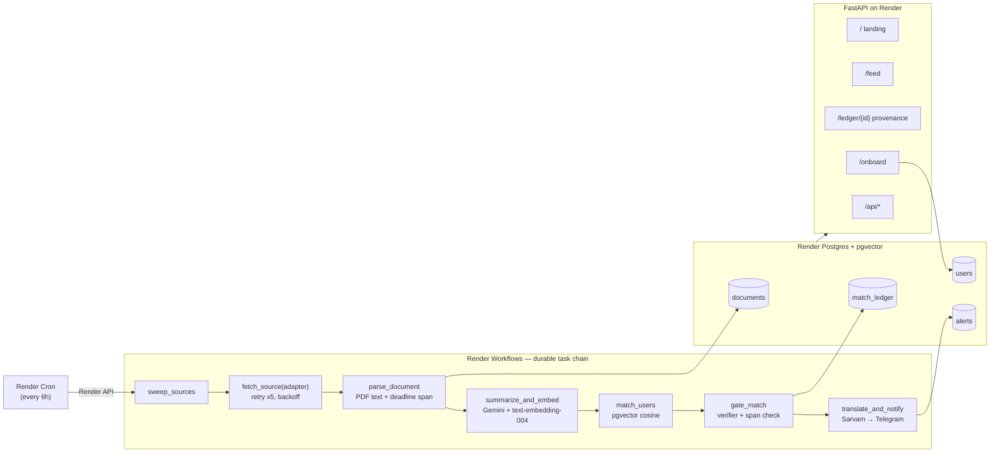

# JanAwaaz (जन आवाज़ — "people's voice")

> **The agent that tells you when your government is asking for your opinion — with proof, in your own language, before the window closes.**

**Live:** [janawaaz-web.onrender.com](https://janawaaz-web.onrender.com)

[](https://github.com/ankitlade12/janawaaz/actions/workflows/ci.yml)
[](LICENSE)
[](https://www.python.org/)

**HACKHAZARDS '26** · Tracks: **Render Workflows** · **Sarvam AI** · Theme: Public Systems, Governance & Civic Tech

---

## The problem

India's Pre-Legislative Consultation Policy (2014) requires ministries to publish draft laws for 30 days of public comment. Regulators — TRAI, SEBI, RBI — run continuous consultation streams on rules that change crop insurance, telecom tariffs, and how your data is used. In practice the comment boxes fill with industry lobbyists, because **ordinary citizens never learn a consultation exists until it has closed**.

In 2015, TRAI's net-neutrality consultation was a 118-page paper with an obscure title ("Regulatory Framework for OTT Services") — the official comments table lists just 27 institutional submissions. It took a viral comedy video and a volunteer team hand-condensing the paper into plain language to wake the country up; a million emails followed. Most consultations never get a viral video. **Discovery and translation are the broken steps, not access — JanAwaaz automates exactly what those volunteers did by hand.**

## What JanAwaaz does

You describe yourself once, in one plain sentence — *"I run a small textile export business in Surat"*. From then on, a durable agent:

1. **Watches** every tracked source on a schedule, surviving flaky government sites with automatic retries.
2. **Parses** each new paper: full text, plus the comment deadline extracted with a **verbatim evidence span**, string-checked against the document. A wrong deadline is worse than no alert — unverifiable deadlines are labelled as such, never invented.
3. **Matches** the paper against every citizen profile semantically (pgvector cosine over 768-dim embeddings).
4. **Gates** every candidate match — the part nobody else does (below).
5. **Alerts** you on Telegram in English, हिन्दी or मराठी via Sarvam AI — with the deadline, what changes for you, where to comment, and the quoted evidence for *why you* got the alert. Optional voice alerts (Sarvam Bulbul TTS) for users who can't comfortably read them.

## Who this is for, honestly

Not "every farmer will install a Telegram bot" — civic-tech adoption research (Mobile Vaani, 100K rural users at peak) shows software alone doesn't reach low-literacy users; offline intermediaries do. JanAwaaz's realistic first users are **the intermediary layer that already does this work by hand**: organizations like Civis (fellows + Trello), journalists, bar and MSME associations, unions, student groups, researchers — plus individually motivated citizens. The 2015 net-neutrality win is the existence proof: when volunteers translated and alerted, a million people acted. The bottleneck was never citizens' willingness — it was that the intermediary layer doesn't scale by hand. JanAwaaz is infrastructure for that layer, free.

## The gate — every alert shows its work

Embedding similarity alone fires garbage: *"interested in agriculture"* matches a telecom tariff paper because both mention "rural". So no alert is sent on similarity alone:

| Tier | Requirement | Consequence |
|---|---|---|
| **1 — Confirmed** | similarity ≥ threshold **AND** an LLM verifier answers a strict yes **AND** returns a verbatim span from the document, **string-checked against the actual text** | push alert |
| **2 — Possible** | similarity passes, but the evidence is weak or the span fails the string check | feed only, never pushes |
| **3 — Rejected** | below threshold, or verifier says no | ledger only |

Every decision — including every rejection — is an append-only row in the **match ledger**: similarity score, verdict, evidence span, span-check result, tier, timestamp. Rendered at `/ledger/{id}` so anyone can audit why an alert fired (or didn't). *If we can't prove the match, we don't wake you up.*

## Architecture



**Sources today:** TRAI (Drupal listing, open + archive) and SEBI (sitemap-based discovery — the feed that can't restructure under us). The adapter contract is one normalized record; **adding a source is one file** plus one registry line. Go/no-go log lives in `janawaaz/adapters/__init__.py` (MCA: 403 bot-wall; RBI: JS-rendered listing — both documented, not hidden).

## Run it locally

```bash
git clone https://github.com/ankitlade12/janawaaz && cd janawaaz
docker compose up -d                  # Postgres 16 + pgvector on :5433
cp .env.example .env                  # add keys; or EMBEDDINGS_PROVIDER=dev to run keyless
uv sync
uv run python scripts/init_db.py
uv run python scripts/seed_corpus.py  # real TRAI + SEBI papers through the real pipeline
uv run python -m janawaaz.pipeline.runner --limit 5   # one full local sweep
uv run uvicorn janawaaz.web.app:app --reload           # product UI on :8000
```

Tests: `uv run pytest` — unit suites run anywhere; gate-flow tests use the database and skip cleanly without one. CI runs everything against a pgvector service container.

## Deploy (Render)

`render.yaml` provisions the web service, the cron trigger, and Postgres. The Workflow service (early access) is created in the dashboard — start command `python main.py` — and Render Cron starts its root task via the API (`scripts/trigger_sweep.py`), since Workflows has no native scheduler yet. Per-task `Retry` config is what turns flaky government sites from an outage into a dashboard entry.

## Sponsor tech, honestly

- **Render Workflows** is the product's spine, not a checkbox: the whole ingestion→gate→notify chain is durable `@app.task`s (`render_sdk`), with retries tuned per task. Plus Render Postgres (pgvector), a Render web service, and Render Cron.
- **Sarvam AI** makes the vernacular promise real: every alert is machine-translated at send time (Mayura), optionally spoken (Bulbul TTS → Telegram audio) — for *every* consultation, not the hand-picked subset a fellowship team can translate by hand.
- **Gemini** handles English summaries, match verification, and embeddings (`text-embedding-004`, 768-dim).

## Who else is in this space

| Player | What they do | What's missing |
|---|---|---|
| **[Civis](https://www.civis.vote)** | The closest mission-mate: plain-language summaries, translations, WhatsApp outreach. Proved the demand. | Human-powered pipeline (fellows + manual tracking) caps coverage and adds days of latency; broadcast, not matched to you |
| **OurGov.in** | Aggregates open consultations | A portal you must remember to visit |
| **MyGov** | Government's own platform | Pull-based, partial coverage |
| **Congress.gov / GovTrack (US)** | Keyword email alerts | Keyword-only, bills not consultations, English only |
| **Enterprise reg-intel** (FiscalNote PolicyNote, Compliance.ai, Wolters Kluwer Compliance Intelligence '25) | Real automated monitoring; semantic document matching is table stakes here | Five figures a year, built for compliance teams, English only — and none advertise cited-evidence verification for their AI alerts |

**Nobody — at any price — shows why you received an alert with cited spans from the source document.** That verification layer is JanAwaaz's contribution. Everything else here exists so a farmer gets it free, in her language, without asking.

## Limitations (known, not hidden)

- Deadline extraction is regex-first with span verification; unusual phrasings fall back to "deadline unverified — check source" rather than a guess.
- Open/closed status for SEBI papers is inferred from the extracted deadline (SEBI doesn't expose it).
- Two sources today; MCA is bot-walled and RBI's listing is JS-rendered — both are adapter candidates via other entry points.
- Matching quality depends on real embeddings; the keyless `dev` embedder exists for development only.

## Roadmap

More regulators (MeitY, state governments) · WhatsApp channel (per-message template pricing since Jul 2025 — costed, not assumed) · missed-call IVR voice access for non-smartphone users (the Mobile Vaani pattern) · **consent-first** comment-drafting help — never automated submission; the FCC's 18-million-fake-comments scandal is the cautionary tale, and it's why every JanAwaaz alert carries verifiable evidence in the first place · Civis-style partners running on top of the ledger as an API.

## License

MIT
