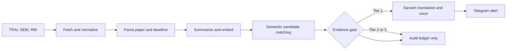
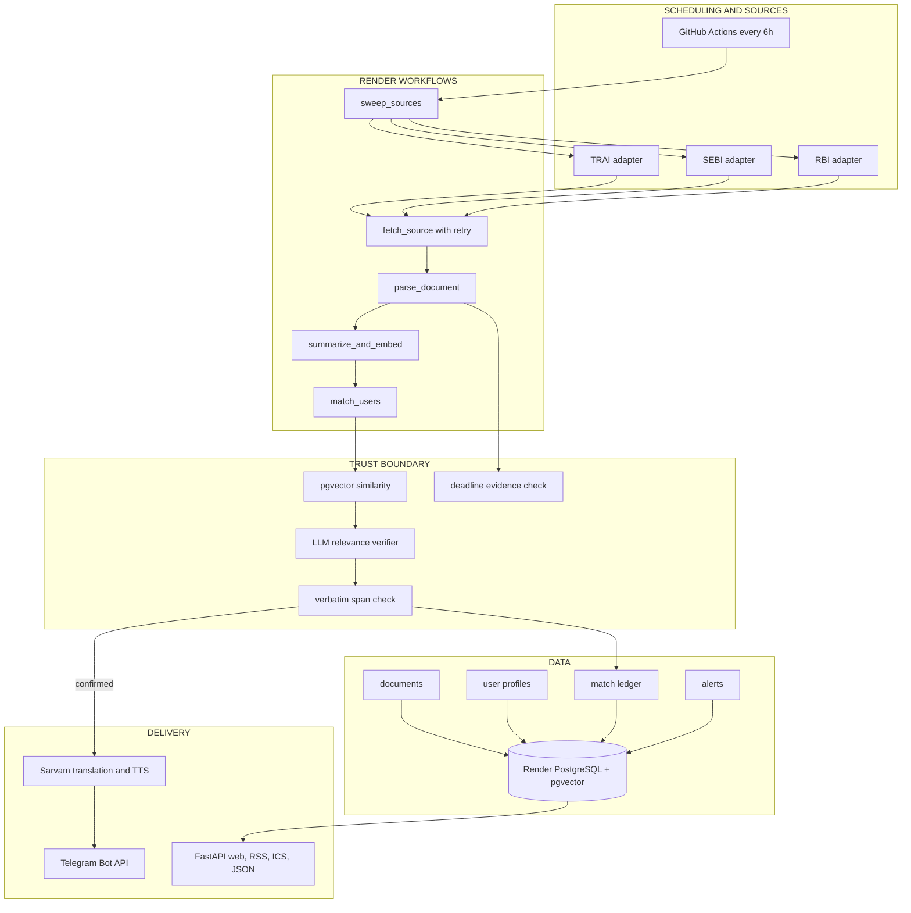

# JanAwaaz — Verified Public-Consultation Alerts

[](https://www.python.org/)
[](https://fastapi.tiangolo.com/)
[](https://render.com/)
[](https://github.com/ankitlade12/janawaaz/actions/workflows/ci.yml)
[](#reproducible-testing)
[](LICENSE)

> **Your government is asking for your opinion. JanAwaaz tells you—with evidence, in your language, before the window closes.**

JanAwaaz (जन आवाज़, “people’s voice”) is a durable monitoring agent for Indian public consultations. It watches regulator websites, extracts new consultation papers and their deadlines, matches them to a citizen or organization’s interests, and sends only evidence-gated alerts.

Every confirmed alert includes the consultation, deadline, comment channel, plain-language impact, and a quotation from the source showing why the match is relevant. Hindi and Marathi alerts are translated with Sarvam AI, with optional voice delivery through Telegram.

**HACKHAZARDS ’26** · Render Workflows · Sarvam AI · Public Systems, Governance & Civic Tech

## Quick Highlights

- **Push, Not Pull** — watches consultation sources continuously instead of requiring users to revisit another portal
- **Evidence-Gated Matching** — semantic similarity proposes candidates; an independent verifier must return a source-backed quotation before an alert can push
- **Deadline Honesty** — extracted dates carry verbatim evidence spans; uncertain deadlines are labeled instead of invented
- **Vernacular Delivery** — English, हिन्दी, and मराठी alerts through Sarvam AI, with optional Bulbul voice output
- **Durable Monitoring** — Render Workflows retries flaky government websites and preserves progress between tasks
- **Auditable Decisions** — every evaluated candidate records its score, verdict, evidence, verification result, and tier
- **Consent-First Telegram** — signed one-tap linking, `/stop`, unsubscribe, and profile deletion; users never paste raw chat IDs
- **Organization-Friendly Feeds** — public web feed, RSS, deadline calendar, JSON API, and shareable consultation pages
- **Extensible Sources** — TRAI, SEBI, and RBI use a shared adapter contract; another source is one module and one registry entry

## Live Deployment

| Surface | URL | Purpose |
|---|---|---|
| **Web application** | [janawaaz-web.onrender.com](https://janawaaz-web.onrender.com) | Landing page and onboarding |
| **Consultation feed** | [janawaaz-web.onrender.com/feed](https://janawaaz-web.onrender.com/feed) | Actionable consultations, closing soonest first |
| **RSS feed** | [janawaaz-web.onrender.com/feed.rss](https://janawaaz-web.onrender.com/feed.rss) | Reader and CMS integration |
| **Deadline calendar** | [janawaaz-web.onrender.com/deadlines.ics](https://janawaaz-web.onrender.com/deadlines.ics) | Subscribable calendar |
| **Health check** | [janawaaz-web.onrender.com/healthz](https://janawaaz-web.onrender.com/healthz) | Deployment status |
| **JSON API** | [janawaaz-web.onrender.com/api/feed](https://janawaaz-web.onrender.com/api/feed) | Machine-readable consultation feed |

The public web service and PostgreSQL database run on Render. A separately configured Render Workflow service executes the durable ingestion chain; GitHub Actions triggers its root task every six hours.

## Architecture Overview

### High-Level Workflow



### System Architecture



The central design rule is: **similarity may nominate a match, but it cannot send an alert.** A push requires a positive verifier verdict and a quotation that can be found in the underlying consultation text.

### Tech Stack

| Layer | Technology | Purpose |
|---|---|---|
| **Web application** | FastAPI + Jinja | Onboarding, feed, consultation pages, ledger, API |
| **Durable execution** | Render Workflows Python SDK | Task chaining, retries, backoff, run history |
| **Database** | PostgreSQL 16 + pgvector | Documents, profiles, embeddings, decisions, alerts |
| **Summaries and verification** | Claude or Gemini | Plain-language summaries and relevance verdicts |
| **Embeddings** | Gemini embedding, 768 dimensions | Semantic consultation/profile matching |
| **Indic language layer** | Sarvam Mayura + Bulbul | Translation and optional text-to-speech |
| **Notifications** | Telegram Bot API | Consent-first text and voice alerts |
| **Document extraction** | PyMuPDF + Beautiful Soup | PDF and HTML text parsing |
| **Testing** | pytest | Unit, database, gate, adapter, and web-flow coverage |
| **Deployment** | Render + GitHub Actions | Web hosting, PostgreSQL, workflows, scheduling |

## The Problem

Indian ministries and regulators publish draft laws, directions, and regulations for public comment. These windows often last only a few weeks, while the source material may be a long PDF with an institutional title buried on a regulator website.

The participation mechanism exists, but discovery is broken:

- citizens and small organizations learn about consultations after they close
- each regulator publishes in a different format
- manual tracking and translation limit how many papers civic intermediaries can cover
- keyword alerts create irrelevant noise and rarely explain why something matched
- a wrong extracted deadline can be worse than no alert at all

The 2015 Indian net-neutrality campaign demonstrated the opportunity. Once volunteers translated a difficult consultation into accessible language and distributed it widely, public participation changed dramatically. Most consultations never receive that manual intervention.

## The Solution

JanAwaaz automates the discovery and translation layer while keeping uncertainty visible:

1. Scheduled workflows inspect every registered source.
2. Source adapters normalize new and revised consultation records.
3. The parser extracts document text, the comment deadline, and the sentence supporting that date.
4. The system writes a plain-language summary and embeds the consultation.
5. pgvector ranks citizen profiles as possible matches.
6. An independent verifier decides whether the consultation materially affects the profile.
7. The verifier’s quotation is mechanically checked against the source text.
8. Confirmed matches are translated and delivered; weak or rejected matches stay in the audit ledger.

The practical first users are civic organizations, journalists, professional associations, unions, researchers, and other intermediaries already tracking consultations manually—alongside individually motivated citizens.

## Evidence Gate

| Tier | Requirement | Result |
|---|---|---|
| **Tier 1 — Confirmed** | Similarity passes, verifier says yes, and evidence span exists in the source | Push alert |
| **Tier 2 — Possible** | Similarity passes, but verification is unavailable or evidence cannot be confirmed | Audit review only |
| **Tier 3 — Rejected** | Verifier says the consultation does not materially affect the profile | Ledger only |

Each evaluated candidate stores:

- consultation and profile identifiers
- cosine similarity score
- verifier verdict and reason
- proposed evidence quotation
- span-verification result
- confidence tier and timestamp
- content fingerprint for retry-safe idempotency

The quotation check proves that the cited words exist in the source. It does not make model judgment infallible, so JanAwaaz describes these as **evidence-gated matches**, not guaranteed relevance.

## Deadline and Data-Quality Controls

- Date extraction only trusts sentences containing both comment context and deadline language.
- Dates on or before publication are rejected as likely historical references.
- Comment deadlines are preferred over later counter-comment deadlines.
- Detail pages are rechecked for deadline extensions.
- Every accepted deadline retains its source sentence.
- Anti-bot challenges and CAPTCHA pages are quarantined before summarization.
- Model responses describing missing or blocked content are discarded.
- Passed deadlines override stale `open` labels from source websites.
- Changed content can be processed again, while retries of an unchanged version reuse the existing decision.

## Product Surfaces

### Citizen and Organization Experience

- Natural-language watch profile: “I run a textile export business in Surat…”
- Signed Telegram connection link—no copied chat ID
- English, Hindi, or Marathi alert delivery
- `/stop`, unsubscribe, and privacy-preserving profile deletion
- Public feed ordered by actionability
- Shareable page for each consultation

### Integration Endpoints

| Endpoint | Purpose |
|---|---|
| `GET /feed` | Public consultation feed |
| `GET /c/{id}` | Shareable consultation detail page |
| `GET /ledger/{id}` | Evidence and gate-decision view |
| `GET /feed.rss` | RSS 2.0 feed |
| `GET /deadlines.ics` | Deadline calendar |
| `POST /api/users` | Create a watch profile |
| `GET /api/feed` | Machine-readable consultation feed |
| `GET /api/ledger/{id}` | Machine-readable gate record |
| `POST /api/telegram/webhook` | Consent linking and bot commands |
| `GET /healthz` | Service health check |

## Quick Start

### Prerequisites

- Python 3.12+
- [uv](https://docs.astral.sh/uv/)
- Docker with Docker Compose
- Gemini API key for production-quality embeddings
- Optional Anthropic key for Claude summaries and verification
- Optional Sarvam and Telegram credentials for translated push alerts

### Installation

```bash
git clone https://github.com/ankitlade12/janawaaz.git
cd janawaaz

docker compose up -d
cp .env.example .env
uv sync

uv run python scripts/init_db.py
uv run python scripts/seed_corpus.py
uv run uvicorn janawaaz.web.app:app --reload
```

Open [http://localhost:8000](http://localhost:8000).

For a keyless local pipeline exercise, set:

```env
EMBEDDINGS_PROVIDER=dev
```

The development embedder verifies storage and control flow but is not semantically meaningful and must not be used to demonstrate matching quality.

### Run a Sweep

```bash
# Full synchronous pipeline
uv run python -m janawaaz.pipeline.runner --limit 5

# Exercise the pipeline without delivering alerts
uv run python -m janawaaz.pipeline.runner --limit 5 --skip-notify

# Render Workflows local development
render workflows dev -- python main.py
```

### Connect Telegram

Set `TELEGRAM_BOT_TOKEN`, `TELEGRAM_BOT_USERNAME`, `TELEGRAM_WEBHOOK_SECRET`, and `APP_SECRET`, then register the webhook:

```bash
curl "https://api.telegram.org/bot$TELEGRAM_BOT_TOKEN/setWebhook" \
  -d "url=https://YOUR_HOST/api/telegram/webhook" \
  -d "secret_token=$TELEGRAM_WEBHOOK_SECRET"
```

The webhook secret must match the deployed `TELEGRAM_WEBHOOK_SECRET`. `APP_SECRET` signs Telegram and profile-management links.

## Reproducible Testing

```bash
# Start PostgreSQL + pgvector so database tests run
docker compose up -d

# Full suite
uv run pytest -q
```

Current verified result:

```text
33 passed
```

Coverage includes deadline extraction, historical-date rejection, evidence-span verification, all three gate tiers, retry idempotency, alert composition, TRAI/RBI adapters, challenge-page detection, signed consent tokens, stale-status correction, onboarding, Telegram linking, `/stop`, and profile deletion.

Without a reachable database, pure unit tests run and database-backed tests skip cleanly. GitHub Actions runs the complete suite against a pgvector service container.

## Project Structure

```text
janawaaz/
├── janawaaz/
│   ├── adapters/              # TRAI, SEBI, RBI source adapters
│   ├── pipeline/              # extract, summarize, match, gate, notify, runner
│   ├── web/                   # FastAPI app, templates, and styles
│   ├── config.py              # environment-backed settings
│   ├── db.py                  # database initialization and additive migrations
│   ├── models.py              # PostgreSQL and pgvector schema
│   └── workflows.py           # Render Workflows task definitions
├── scripts/                   # database init, corpus seed, workflow trigger
├── tests/                     # unit and integration test suite
├── docs/
│   └── janawaaz-deck.pptx     # submission deck
├── .github/workflows/         # CI and six-hour workflow trigger
├── docker-compose.yml         # local PostgreSQL + pgvector
├── render.yaml                # Render web and database blueprint
├── main.py                    # Render Workflow service entry point
└── pyproject.toml
```

## Deployment

`render.yaml` provisions the FastAPI web service and PostgreSQL database. Render Workflows currently requires a separate Workflow service:

- build command: `pip install .`
- start command: `python main.py`
- service name: `janawaaz-workflows`
- environment: the same `DATABASE_URL` and API credentials as the web service

The included GitHub Actions schedule calls `scripts/trigger_sweep.py` every six hours. Set the repository secret `RENDER_API_KEY` so it can start `janawaaz-workflows/sweep_sources`.

Required production secrets are documented in [`.env.example`](.env.example). Never commit `.env`; it is ignored by Git.

## Sources

| Source | Discovery strategy | Notes |
|---|---|---|
| **TRAI** | Server-rendered open and archive listings | Consultation PDFs and structured metadata |
| **SEBI** | Official sitemap filtered to consultation pages | Deadlines commonly extracted from attached PDFs |
| **RBI** | Draft Directions listing plus RSS fallback | Anti-bot responses are quarantined |

The normalized adapter contract lives in `janawaaz/adapters/base.py`. MCA is not currently tracked because its public interface returns a bot wall to the service.

## Honest Limitations

- Only three national regulators are tracked today.
- Some RBI papers intermittently return anti-bot challenges and remain unprocessed until a later successful sweep.
- Evidence-span verification proves quotation provenance, not perfect relevance judgment.
- The ledger is append-only by service behavior, not a cryptographic or regulator-grade immutable log.
- Matching quality requires production embeddings; the development embedder is only a control-flow fallback.
- Telegram is a practical free delivery channel, but broader citizen reach requires partner distribution and eventually WhatsApp or IVR.

## Roadmap

- Add MeitY, state-government, and additional regulator adapters
- Provide partner workspaces and organization-specific digests
- Add costed WhatsApp delivery and missed-call IVR access
- Publish evaluation metrics for relevance precision and deadline extraction
- Offer consent-first comment drafting without automated submission
- Expose partner APIs on top of the evidence ledger

## License

JanAwaaz is open source under the [MIT License](LICENSE).
